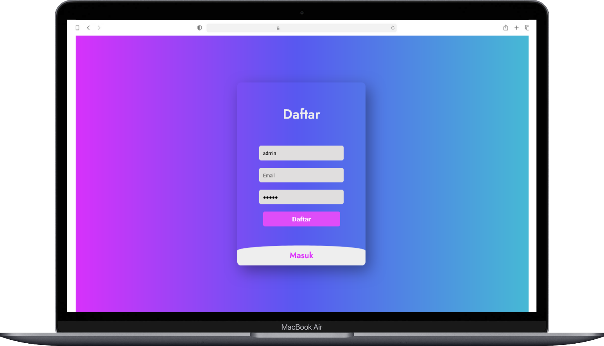

# Login Register php menggunakan database mysql

## instalasi minimum
- min Php version 7.4 

## intalasi
1. git clone (https://https://github.com/harisfariyano/Login-Register-php-session-mysql.git)
2. db configurasi config/koneksi.php

